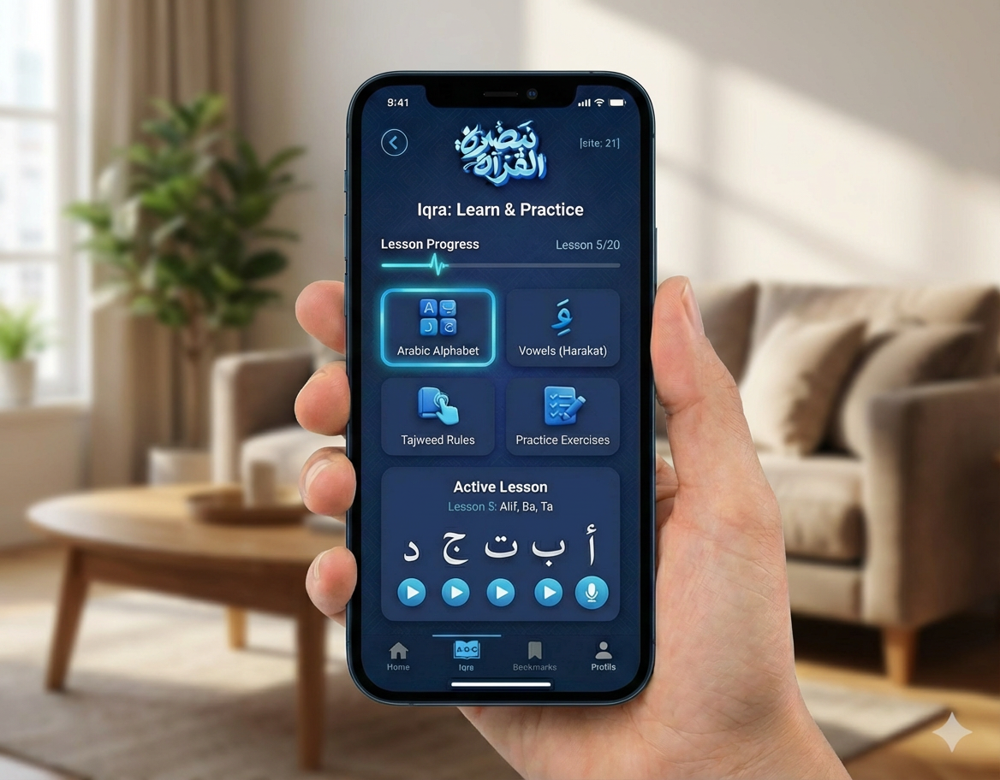

<div align="center">

# 🕌 QuranPulse

### Malaysia's First AI-Powered Quran Learning PWA

*Belajar Al-Quran dengan Kuasa AI — untuk umat Malaysia*

[](https://nextjs.org/)
[](https://react.dev/)
[](https://www.typescriptlang.org/)
[](https://tailwindcss.com/)
[](https://supabase.com/)
[](https://docs.openclaw.ai/)
[](https://www.npmjs.com/package/z-ai-web-dev-sdk)
[](https://web.dev/progressive-web-apps/)
[](LICENSE)

</div>

---

## 📖 Table of Contents

- [Overview](#-overview)
- [Key Features](#-key-features)
- [Screenshots](#-screenshots)
- [Tech Stack](#-tech-stack)
- [Getting Started](#-getting-started)
- [Project Structure](#-project-structure)
- [API Routes](#-api-routes)
- [OpenClaw Integration](#-openclaw-integration)
- [Supabase Integration](#-supabase-integration)
- [JAKIM Integration](#-jakim-integration)
- [Contributing](#-contributing)
- [License](#-license)
- [Credits](#-credits)

---

## 🌟 Overview

**QuranPulse** is Malaysia's first AI-powered Quran learning Progressive Web App (PWA), designed specifically for Malaysian Muslims. It combines cutting-edge AI technology with authentic Islamic scholarship to deliver a comprehensive, localized, and engaging Quran learning experience.

Built with a stunning **Deep Blue Monochromatic** theme featuring Islamic geometric patterns and gold accents, QuranPulse offers five powerful modules:

| Module | Description |
|--------|-------------|
| 🏠 **Home** | Dashboard with daily verse, prayer countdown, hadith, and challenges |
| 📖 **Quran** | Full 114-surah reader with 6 reading modes and AI recitation |
| 🤖 **Ustaz AI** | Multi-persona Islamic AI chatbot with OpenClaw agent routing |
| 🌙 **Ibadah** | Prayer times, Qibla compass, Tasbih counter, Hijri calendar, Khutbah |
| 🎓 **Iqra** | 6-book Iqra system with AI tutor, flashcards, quizzes, and hafazan |

### Why QuranPulse?

- 🇲🇾 **Malaysia-First**: JAKIM prayer zones, Bahasa Melayu, Mazhab Syafie
- 🤖 **AI-Powered**: LLM chat, ASR/TTS voice, image generation, web search
- 🎮 **Gamified**: XP, levels, streaks, daily challenges
- 📱 **PWA**: Install on any device, works offline
- 🔒 **JAKIM-Compliant**: Verified sources, mandatory disclaimers, no figurative art

---

## ✨ Key Features

### 🏠 Home Tab — Dashboard & Daily Inspiration

- ☀️ **Islamic Greeting** — Time-based salam (Assalamualaikum, Selamat Pagi, etc.)
- 🔥 **Streak & XP Cards** — Glass morphism stats with animated numbers
- 📊 **Weekly Activity Heatmap** — 7-bar contribution chart
- ⏰ **Smart Prayer Countdown** — Live countdown with circular progress ring (JAKIM zones)
- 📜 **Daily Verse** — Arabic + Malay translation with TTS audio & word-by-word breakdown
- 📿 **Hadith of the Day** — 15 authentic hadiths in Bahasa Melayu
- 🎯 **Quick Actions Grid** — 6 haptic-enabled shortcuts (+2 XP each)
- 🏆 **Daily Challenges** — 10 rotating Islamic challenges with XP rewards
- 📖 **Continue Reading** — Resume where you left off

### 📖 Quran Tab — Complete Quran Reader

- 📚 **Full 114 Surah List** — Search & filter (All / Makkiyah / Madaniyyah)
- 🔖 **Surah Bookmarks** — Favorite surahs for quick access
- 📝 **6 Reading Modes**:
  - Surah view (Arabic + Malay + English)
  - Juz view (30 juz)
  - Hizb view (60 hizb)
  - Page view (604-page Mushaf)
  - Manzil view (7 manzil)
  - Audio recitation (12 reciters)
- 🎵 **Audio Playback** — Verse-by-verse from alquran.cloud CDN
- 🔍 **Search** — Full-text search in Arabic, Malay, and English
- 📖 **Tafsir** — Al-Muyassar tafsir for any ayah
- 🤲 **Sajda Detection** — 14 sajda positions highlighted
- ✍️ **Tajwid Rules** — 10 rules with Malay descriptions and examples

### 🤖 Ustaz AI Tab — AI Islamic Assistant

- 👤 **3 Persona System**:
  - Ustaz Azhar (Fiqh & Hukum — Mazhab Syafie)
  - Ustazah Aishah (Akidah & Akhlak)
  - Ustaz Zak (Sirah & Sejarah)
- 🔄 **Dual Mode**:
  - **Classic Chat** — Direct LLM via z-ai-web-dev-sdk
  - **OpenClaw Agent** — Multi-agent routing via OpenClaw Gateway
- 🎤 **Voice Input** — ASR speech-to-text (10-second auto-stop)
- 🔊 **Voice Output** — TTS text-to-speech on AI responses
- 🌐 **Web Search** — Real-time Islamic knowledge lookup
- 🎨 **Islamic Art Generation** — Non-figurative khat & geometric art
- 🛠️ **9 OpenClaw Tools** — Web search, image/video/music gen, prayer reminders, etc.
- 💬 **Chat Features** — Emoji reactions, copy, timestamps, JAKIM disclaimer
- ⚡ **Status Indicator** — Real-time OpenClaw Gateway reachability

### 🌙 Ibadah Tab — Worship Companion

- 🕌 **Prayer Times** — 52 JAKIM zones across all Malaysian states with live countdown
- 🧭 **Qibla Compass** — Device orientation API with animated compass (292.5° KL)
- 📿 **Tasbih Counter** — Circular progress ring with 4 dhikr categories & vibration/sound
- 📅 **Hijri Calendar** — Monthly view with notable Islamic days
- 📖 **Hadith Collection** — 35 authentic hadiths in Bahasa Melayu
- 📜 **e-Khutbah** — JAKIM Friday/Eid/Ramadan khutbah reader

### 🎓 Iqra Tab — Learn to Read Quran

- 📚 **6-Book Iqra System**:
  - Iqra 1: Hijaiyah Letters (29 letters)
  - Iqra 2: Harakat (Fathah, Kasrah, Dhammah)
  - Iqra 3: Tanwin & Mad
  - Iqra 4: Tajwid Lanjutan
  - Iqra 5: Waqaf & Ibtida
  - Iqra 6: Bacaan Al-Quran
- 🎮 **3 Practice Modes**:
  - Flashcard — Flip cards with letter/name
  - Quiz — Multiple choice with scoring
  - Matching — Grid-based pair matching
- 🤖 **AI Tutor** — "Tanya Cikgu" chatbot for instant help
- 📖 **Tajwid Rules Reference** — 14 rules in 5 categories
- 🧠 **Hafazan Tracker** — 20 short surahs with spaced repetition
- 📊 **Progress Dashboard** — Per-book progress, tajwid mastery, hafazan tracking

---

## 📸 Screenshots

> Screenshots placeholder — to be added

| Home Dashboard | Quran Reader | Ustaz AI Chat |
|:---:|:---:|:---:|
|  |  |  |

| Ibadah Prayer Times | Qibla Compass | Iqra Learning |
|:---:|:---:|:---:|
| *Coming soon* | *Coming soon* | *Coming soon* |

---

## 🛠️ Tech Stack

### Core Framework

| Technology | Version | Purpose |
|-----------|---------|---------|
| [Next.js](https://nextjs.org/) | 16 | React framework with App Router |
| [React](https://react.dev/) | 19 | UI library |
| [TypeScript](https://www.typescriptlang.org/) | 5 | Type-safe JavaScript |
| [Tailwind CSS](https://tailwindcss.com/) | 4 | Utility-first CSS |
| [shadcn/ui](https://ui.shadcn.com/) | Latest | 46 UI components (New York style) |

### State & Data

| Technology | Purpose |
|-----------|---------|
| [Zustand](https://zustand.docs.pmnd.rs/) | Client state management |
| [TanStack Query](https://tanstack.com/query) | Server state management |
| [Prisma](https://www.prisma.io/) | ORM (SQLite for local dev) |
| [Supabase](https://supabase.com/) | PostgreSQL database + Auth + RLS |

### AI & Communication

| Technology | Purpose |
|-----------|---------|
| [z-ai-web-dev-sdk](https://www.npmjs.com/package/z-ai-web-dev-sdk) | LLM, VLM, ASR, TTS, Image Gen, Web Search |
| [OpenClaw](https://docs.openclaw.ai/) | Multi-agent AI system with skills |
| [Framer Motion](https://motion.dev/) | Animations & transitions |

### External APIs

| API | Purpose |
|-----|---------|
| [alquran.cloud](https://alquran.cloud/) | Quran text, translations, audio, search, tafsir |
| [waktusolat.app](https://waktusolat.app/) | JAKIM prayer times (e-Solat) |
| [JAKIM](https://www.islam.gov.my/) | Halal status, khutbah, Islamic calendar |
| [aladhan.com](https://aladhan.com/) | Hijri calendar conversion |

---

## 🚀 Getting Started

### Prerequisites

- **Node.js** >= 18
- **Bun** >= 1.0 (recommended package manager)
- **Supabase account** (optional — works offline without it)
- **OpenClaw CLI** (optional — for multi-agent features)

### Installation

```bash
# Clone the repository
git clone https://github.com/your-org/quranpulse.git
cd quranpulse

# Install dependencies
bun install

# Set up environment variables
cp .env.example .env.local
```

### Environment Variables

Create a `.env.local` file with the following variables:

```env
# ─── Supabase (Optional — required for cloud sync) ───
NEXT_PUBLIC_SUPABASE_URL=https://your-project.supabase.co
NEXT_PUBLIC_SUPABASE_ANON_KEY=your-anon-key

# ─── Prisma / Local Database ───
DATABASE_URL=file:./db/custom.db

# ─── OpenClaw Gateway (Optional — for multi-agent AI) ───
OPENCLAW_GATEWAY_URL=http://127.0.0.1:18789

# ─── z-ai-web-dev-sdk (Built-in) ───
# No API key needed — SDK is pre-configured
```

### Running the App

```bash
# Start the Next.js development server
bun run dev

# Start the OpenClaw Gateway mini-service (optional)
cd mini-services/openclaw-gateway
bun run dev

# Push database schema (for local SQLite)
bun run db:push

# Run linting
bun run lint
```

The app will be available at **http://localhost:3000**

---

## 📁 Project Structure

```
quranpulse/
├── prisma/
│   └── schema.prisma                 # Prisma schema (SQLite local dev)
├── public/
│   ├── audio/hijaiyah/              # 29 Arabic letter audio files
│   ├── books/                       # Iqra PDF books (1-6)
│   ├── icons/                       # PWA icons (192px, 512px, maskable)
│   ├── iqra_json/                   # Iqra page data (JSON)
│   ├── screenshots/                 # App screenshots
│   ├── favicon.ico
│   ├── logo.svg
│   ├── manifest.webmanifest         # PWA manifest
│   └── sw.js                        # Service worker
├── src/
│   ├── app/
│   │   ├── api/
│   │   │   ├── asr/route.ts         # Speech-to-text endpoint
│   │   │   ├── tts/route.ts         # Text-to-speech endpoint
│   │   │   ├── ustaz-ai/route.ts    # Main AI chatbot endpoint
│   │   │   ├── jakim/
│   │   │   │   ├── solat/route.ts   # JAKIM prayer times
│   │   │   │   ├── zones/route.ts   # 52 JAKIM zones
│   │   │   │   └── khutbah/route.ts # e-Khutbah reader
│   │   │   ├── quran/
│   │   │   │   ├── surah/route.ts   # Surah list & detail
│   │   │   │   ├── search/route.ts  # Quran text search
│   │   │   │   ├── juz/route.ts     # Juz data
│   │   │   │   └── tafsir/route.ts  # Tafsir lookup
│   │   │   ├── openclaw/
│   │   │   │   ├── status/route.ts       # Gateway health check
│   │   │   │   ├── skills/route.ts       # Skills list
│   │   │   │   ├── sessions/route.ts     # Active sessions
│   │   │   │   ├── cron/route.ts         # Scheduled tasks
│   │   │   │   ├── message/route.ts      # Agent messaging
│   │   │   │   ├── chat/route.ts         # OpenAI-compat chat
│   │   │   │   ├── generate/route.ts     # Media generation
│   │   │   │   ├── web-search/route.ts   # Web search
│   │   │   │   ├── models/route.ts       # Available models
│   │   │   │   └── schedule-prayer/route.ts # Prayer scheduling
│   │   │   └── supabase/
│   │   │       ├── profile/route.ts      # User profile CRUD
│   │   │       ├── bookmarks/route.ts    # Verse/surah bookmarks
│   │   │       ├── chat/route.ts         # Chat history
│   │   │       ├── reading/route.ts      # Reading progress
│   │   │       ├── iqra/route.ts         # Iqra progress
│   │   │       ├── tasbih/route.ts       # Tasbih sessions
│   │   │       └── xp/route.ts           # XP logging
│   │   ├── globals.css              # Global styles + Raudhah theme vars
│   │   ├── layout.tsx               # Root layout with metadata
│   │   └── page.tsx                 # Main page (AppShell + Splash)
│   ├── components/
│   │   ├── quranpulse/
│   │   │   ├── AppShell.tsx         # 5-tab shell + bottom navigation
│   │   │   ├── SplashScreen.tsx     # Animated splash screen
│   │   │   └── tabs/
│   │   │       ├── HomeTab.tsx      # Dashboard & daily content
│   │   │       ├── QuranTab.tsx     # Quran reader & surah list
│   │   │       ├── UstazAITab.tsx   # AI chatbot with OpenClaw
│   │   │       ├── IbadahTab.tsx    # Prayer, Qibla, Tasbih, etc.
│   │   │       └── IqraTab.tsx      # Iqra learning system
│   │   └── ui/                      # 46 shadcn/ui components
│   │       ├── accordion.tsx
│   │       ├── alert.tsx
│   │       ├── avatar.tsx
│   │       ├── badge.tsx
│   │       ├── button.tsx
│   │       ├── card.tsx
│   │       ├── carousel.tsx
│   │       ├── checkbox.tsx
│   │       ├── dialog.tsx
│   │       ├── drawer.tsx
│   │       ├── dropdown-menu.tsx
│   │       ├── form.tsx
│   │       ├── input.tsx
│   │       ├── progress.tsx
│   │       ├── select.tsx
│   │       ├── sheet.tsx
│   │       ├── skeleton.tsx
│   │       ├── slider.tsx
│   │       ├── switch.tsx
│   │       ├── tabs.tsx
│   │       ├── textarea.tsx
│   │       ├── toast.tsx
│   │       ├── tooltip.tsx
│   │       └── ... (23 more)
│   ├── hooks/
│   │   ├── useOpenClaw.ts           # OpenClaw integration hook
│   │   ├── useSupabaseSync.ts       # Supabase state sync (imported)
│   │   ├── use-mobile.ts            # Mobile detection
│   │   └── use-toast.ts             # Toast notifications
│   ├── lib/
│   │   ├── db.ts                    # Prisma client
│   │   ├── utils.ts                 # Utility functions (cn, etc.)
│   │   ├── quran-data.ts            # Static Quran data (114 surahs, etc.)
│   │   ├── quran-service.ts         # Quran API service (alquran.cloud)
│   │   ├── jakim-service.ts         # JAKIM service (prayer, halal, khutbah)
│   │   └── supabase/
│   │       ├── client.ts            # Supabase browser client
│   │       ├── server.ts            # Supabase server client
│   │       ├── types.ts             # Database type definitions
│   │       ├── middleware.ts        # Auth middleware
│   │       └── useSupabaseSync.ts   # State sync hook
│   ├── stores/
│   │   └── quranpulse-store.ts      # Zustand global store
│   └── middleware.ts                 # Next.js middleware
├── mini-services/
│   ├── openclaw-gateway/
│   │   ├── index.ts                 # OpenClaw Gateway v2 (port 3030)
│   │   └── package.json
│   └── quranpulse/
│       ├── index.ts                 # QuranPulse service (port 3003)
│       └── package.json
├── openclaw-workspace/
│   ├── openclaw.json                # OpenClaw config (5 agents, channels)
│   ├── AGENTS.md                    # Agent directory & specializations
│   └── skills/
│       ├── quranpulse-ustaz-ai.md   # Main Islamic assistant skill
│       ├── quranpulse-quran-search.md # Quran search skill
│       ├── quranpulse-prayer-ibadah.md # Prayer & ibadah skill
│       ├── quranpulse-islamic-art.md  # Islamic art generation skill
│       └── quranpulse-iqra-hafazan.md # Iqra & hafazan skill
├── supabase/
│   └── schema.sql                   # Complete database schema + RLS
├── examples/
│   └── websocket/                   # WebSocket examples
├── agent-ctx/                       # Agent work records
├── worklog.md                       # Development work log
├── Caddyfile                        # Gateway reverse proxy config
├── next.config.ts                   # Next.js configuration
├── package.json                     # Dependencies
├── tailwind.config.ts               # Tailwind CSS config
└── tsconfig.json                    # TypeScript config
```

---

## 🛣️ API Routes

### Quran API

| Endpoint | Method | Description |
|----------|--------|-------------|
| `/api/quran/surah` | `GET` | Fetch surah list (114) or specific surah with ayahs |
| `/api/quran/search` | `GET` | Search Quran text (Arabic, Malay, English) |
| `/api/quran/juz` | `GET` | Fetch juz list (30) or specific juz with surahs |
| `/api/quran/tafsir` | `GET` | Get tafsir for a specific ayah (Al-Muyassar) |

**Query Parameters:**

```bash
# Get specific surah
GET /api/quran/surah?number=1

# Search Quran
GET /api/quran/search?q=bismillah&language=ms

# Get specific juz
GET /api/quran/juz?number=30

# Get tafsir
GET /api/quran/tafsir?surah=1&ayah=1
```

### JAKIM API

| Endpoint | Method | Description |
|----------|--------|-------------|
| `/api/jakim/solat` | `GET` | Prayer times for a JAKIM zone |
| `/api/jakim/zones` | `GET` | List all 52 JAKIM prayer zones |
| `/api/jakim/khutbah` | `GET` | JAKIM Friday/Eid/Ramadan khutbah |

**Query Parameters:**

```bash
# Get prayer times for Kuala Lumpur
GET /api/jakim/solat?zone=WPKL01

# Get prayer times for specific date
GET /api/jakim/solat?zone=WPKL01&date=2025-01-15
```

### AI API

| Endpoint | Method | Description |
|----------|--------|-------------|
| `/api/ustaz-ai` | `POST` | Main AI chatbot (3 personas, web search, image gen) |
| `/api/tts` | `POST` | Text-to-speech conversion |
| `/api/asr` | `POST` | Speech-to-text conversion |

**Request Body (Ustaz AI):**

```json
{
  "message": "Apakah hukum solat berjemaah?",
  "persona": "ustaz",
  "history": [],
  "enableWebSearch": false,
  "enableImageGen": false
}
```

### OpenClaw API

| Endpoint | Method | Description |
|----------|--------|-------------|
| `/api/openclaw/status` | `GET` | Gateway health check |
| `/api/openclaw/skills` | `GET` | Available OpenClaw skills |
| `/api/openclaw/sessions` | `GET` | Active agent sessions |
| `/api/openclaw/cron` | `GET` | Scheduled cron jobs |
| `/api/openclaw/models` | `GET` | Available AI models |
| `/api/openclaw/message` | `POST` | Send message to agent |
| `/api/openclaw/chat` | `POST` | OpenAI-compatible chat completions |
| `/api/openclaw/generate` | `POST` | Media generation (image/video/music) |
| `/api/openclaw/web-search` | `POST` | Web search via OpenClaw |
| `/api/openclaw/schedule-prayer` | `POST` | Schedule prayer reminder |

**OpenAI-Compatible Chat Example:**

```bash
curl -X POST /api/openclaw/chat?XTransformPort=3030 \
  -H "Content-Type: application/json" \
  -d '{
    "model": "openclaw/ustaz-azhar",
    "messages": [
      {"role": "user", "content": "Hukum puasa Isnin Khamis?"}
    ],
    "stream": false
  }'
```

### Supabase API

| Endpoint | Method | Description |
|----------|--------|-------------|
| `/api/supabase/profile` | `GET/POST` | User profile CRUD |
| `/api/supabase/bookmarks` | `GET/POST/DELETE` | Verse & surah bookmarks |
| `/api/supabase/reading` | `GET/POST` | Reading progress |
| `/api/supabase/chat` | `GET/POST/DELETE` | Chat history |
| `/api/supabase/iqra` | `GET/POST` | Iqra progress |
| `/api/supabase/tasbih` | `GET/POST` | Tasbih sessions |
| `/api/supabase/xp` | `GET/POST` | XP logging |

---

## 🤖 OpenClaw Integration

QuranPulse features deep integration with [OpenClaw](https://docs.openclaw.ai/), an open-source multi-agent AI system.

### Architecture

```
User → QuranPulse UI → Next.js API → OpenClaw Gateway (port 3030) → OpenClaw (port 18789)
                                                                    ↓
                                                            5 Specialized Agents
                                                                    ↓
                                                            5 Custom Skills
```

### 5 Agents

| Agent ID | Name | Specialization | Skills |
|----------|------|----------------|--------|
| `ustaz-azhar` | Ustaz Azhar | Fiqh & Hukum (Mazhab Syafie) | ustaz-ai, quran-search, prayer-ibadah |
| `ustazah-aishah` | Ustazah Aishah | Akidah & Akhlak | ustaz-ai, quran-search |
| `ustaz-zak` | Ustaz Zak | Sirah & Sejarah Islam | ustaz-ai, quran-search |
| `iqra-teacher` | Cikgu Iqra | Iqra & Hafazan | iqra-hafazan, ustaz-ai |
| `islamic-artist` | Islamic Art Gen | Khat & Islamic Art | islamic-art |

### 5 Skills

| Skill | File | Description |
|-------|------|-------------|
| `quranpulse-ustaz-ai` | `skills/quranpulse-ustaz-ai.md` | Main Islamic knowledge assistant (Malay, JAKIM, citations) |
| `quranpulse-quran-search` | `skills/quranpulse-quran-search.md` | Quran verse search with tafsir |
| `quranpulse-prayer-ibadah` | `skills/quranpulse-prayer-ibadah.md` | Prayer times, ibadah guidance, scheduling |
| `quranpulse-islamic-art` | `skills/quranpulse-islamic-art.md` | Islamic art generation (non-figurative rules) |
| `quranpulse-iqra-hafazan` | `skills/quranpulse-iqra-hafazan.md` | Iqra learning and hafazan method |

### Gateway Endpoints

The OpenClaw Gateway v2 (port 3030) provides:

- **OpenAI-Compatible API** — Drop-in replacement for any OpenAI client
- **Agent Routing** — Automatic persona → agentId mapping
- **Media Generation** — Image, video, and nasheed generation
- **Web Search** — Real-time web search with Islamic context
- **Prayer Scheduling** — Cron-based prayer reminders
- **Multi-Channel** — WhatsApp, Telegram, Discord, WebChat support

### Graceful Fallback

When the OpenClaw Gateway is offline, QuranPulse automatically falls back to:
1. **Classic Chat** — Direct LLM via z-ai-web-dev-sdk
2. **Local Data** — Cached prayer times, surah data
3. **Offline Mode** — Full app functionality without AI features

---

## 🗄️ Supabase Integration

### Database Schema (9 Tables)

| Table | Purpose | RLS |
|-------|---------|-----|
| `profiles` | User profiles (XP, level, streak, font_size) | User-scoped |
| `bookmarked_verses` | Bookmarked Quran verses | User-scoped |
| `bookmarked_surahs` | Bookmarked Quran surahs | User-scoped |
| `reading_progress` | Last read position | User-scoped (one row) |
| `tasbih_sessions` | Tasbih counter sessions | User-scoped |
| `iqra_progress` | Iqra book/page completion | User-scoped |
| `chat_messages` | Ustaz AI chat history | User-scoped |
| `xp_log` | XP gain audit trail | User-scoped |
| `anonymous_sessions` | Non-authenticated user data | Open access |

### Row Level Security (RLS)

All tables have RLS enabled with policies ensuring:
- Users can only **read** their own data (`auth.uid() = user_id`)
- Users can only **write** their own data
- Anonymous sessions are accessible by `session_id`

### Auto-Profile Creation

A PostgreSQL trigger (`handle_new_user`) automatically creates a profile when a new user signs up via Supabase Auth.

### State Sync

The `useSupabaseSync` hook provides:
- **Debounced sync** — Zustand store → Supabase (2-second debounce)
- **Auto-load** — Supabase → Zustand store on mount
- **Silent failure** — Local state remains valid if Supabase is unavailable

---

## 🇲🇾 JAKIM Integration

### Prayer Times (e-Solat)

- **52 JAKIM Zones** across all 14 Malaysian states + WP
- Real-time prayer times from waktusolat.app API (wraps e-solat.gov.my)
- 6 daily prayers: Subuh, Syuruk, Zohor, Asar, Maghrib, Isyak
- Hijri date included in prayer time response
- Hardcoded KL fallback when API unavailable

### Zone Coverage

| State | Zones | Example Codes |
|-------|-------|---------------|
| Wilayah Persekutuan | 3 | WPKL01, WPS01, WPL01 |
| Johor | 4 | JHR01-JHR04 |
| Kedah | 7 | KDH01-KDH07 |
| Kelantan | 2 | KTN01-KTN02 |
| Melaka | 1 | MLK01 |
| Negeri Sembilan | 2 | NSN01-NSN02 |
| Pahang | 2 | PHS01-PHS02 |
| Pulau Pinang | 1 | PNG01 |
| Perak | 7 | PRK01-PRK07 |
| Sabah | 7 | SBH01-SBH07 |
| Sarawak | 9 | SWK01-SWK09 |
| Selangor | 4 | SGR01-SGR04 |
| Terengganu | 2 | TRG01-TRG02 |
| Perlis | 1 | PLS01 |

### Other JAKIM Features

- **Halal Status** — JAKIM halal certification lookup
- **e-Khutbah** — Friday, Eid, and Ramadan khutbah
- **Hijri Calendar** — Month names in Malay, notable Islamic days
- **Date Conversion** — Gregorian ↔ Hijri (approximate)

---

## 🤝 Contributing

We welcome contributions from the community! Here's how you can help:

### Development Setup

1. Fork the repository
2. Create a feature branch: `git checkout -b feature/amazing-feature`
3. Make your changes
4. Run linting: `bun run lint`
5. Commit: `git commit -m 'Add amazing feature'`
6. Push: `git push origin feature/amazing-feature`
7. Open a Pull Request

### Coding Standards

- **TypeScript** throughout — no `any` types
- **ESLint** must pass with zero errors
- **Bahasa Melayu** for all user-facing text
- **JAKIM compliance** for all Islamic content
- **Non-figurative art** only for Islamic art generation
- **Mazhab Syafie** as the default fiqh reference

### Content Guidelines

- All Islamic rulings must include JAKIM disclaimer
- Quran translations must use Basmeih (Malay) and Sahih International (English)
- Hadith must reference authentic sources (Bukhari, Muslim, etc.)
- Prayer times must use JAKIM e-Solat data

---

## 📄 License

This project is licensed under the **MIT License** — see the [LICENSE](LICENSE) file for details.

---

## 🙏 Credits

### Data Sources

| Source | Usage | URL |
|--------|-------|-----|
| **alquran.cloud** | Quran text, translations, audio, search, tafsir | [alquran.cloud](https://alquran.cloud/) |
| **JAKIM e-Solat** | Malaysian prayer times | [e-solat.gov.my](https://www.e-solat.gov.my/) |
| **waktusolat.app** | JAKIM prayer time API wrapper | [waktusolat.app](https://api.waktusolat.app/) |
| **JAKIM** | Halal status, khutbah, Islamic calendar | [islam.gov.my](https://www.islam.gov.my/) |
| **Aladhan** | Hijri calendar conversion | [aladhan.com](https://aladhan.com/) |
| **MyHadith** | Authentic hadith collection | Various sources |

### Technology

| Project | Contribution |
|---------|-------------|
| **Next.js** | React framework by Vercel |
| **shadcn/ui** | Beautiful UI component library |
| **Zustand** | Lightweight state management |
| **Framer Motion** | Smooth animations |
| **OpenClaw** | Multi-agent AI framework |
| **Supabase** | Open-source Firebase alternative |
| **Prisma** | Next-generation ORM |

### Islamic Scholarship

- **Tafsir Al-Muyassar** — Simplified tafsir by Saudi scholars
- **Basmeih Translation** — Malay Quran translation by Abdullah Basmeih
- **Sahih International** — English Quran translation
- **Mazhab Syafie** — Fiqh references following Imam Syafie's school

---

<div align="center">

**بسم الله الرحمن الرحيم**

*In the name of Allah, the Most Gracious, the Most Merciful*

Made with ❤️ for the Muslim Ummah of Malaysia

🕌 **QuranPulse** — *Nadi Al-Quran, Denai Keimanan*

</div>
